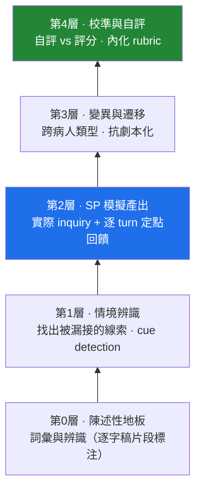
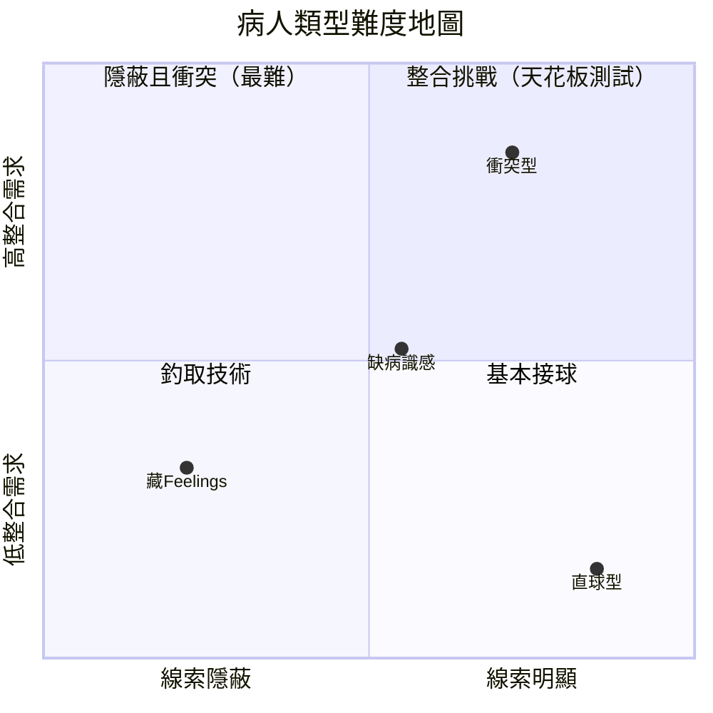

# FIFE 學習方案 · 分層藍圖

> **這是什麼**：以「標準病人模擬 + 定點回饋」為主體的 FIFE 會談技能訓練方案，適用於任何想把 FIFE 從「知道」練成「做得到」的學習者。
> **這不是什麼**：它不是評分／認證引擎。本文件第 9 節的評分框架是**練習用的輕量形成性回饋尺規**，不是經過效化的正式評量工具，不應與任何正式評分、認證或研究用評分系統混用。

---

## 1. 這套藍圖給誰

**適合**
- 學習以「會談／訪談表現」為核心的技能者（FIFE、病人中心會談、生理疾患 OT 情境）。
- 已具備基本 FIFE 概念與詞彙，想把「能說出來」變成「在對話中做得出來」的人。
- 願意接受費力的提取式練習與直接、不修飾的回饋的人。

**不適合（或需先補別的）**
- 完全沒接觸過 FIFE、連基本詞彙都還沒有的人 → 先補第 0 層的陳述性地板或先上概念課，再進本方案。
- 只想取得陳述性知識、應付筆試的人 → 本方案不是為筆試設計的。
- 想要被肯定、要舒服學習體驗的人 → 本方案刻意費力、回饋直接，過程不舒服是正常的。

---

## 2. 學習目的與核心學習目標

**學習目的（為什麼練）**
把 FIFE 從「能說出來的知識」轉成「在真實對話壓力下做得出來的表現」。

**核心學習目標（最終要學會什麼）**
> 在真實會談中，能主動**察覺**病人釋放的 FIFE 線索、即時**回應並深掘**，並在線索彼此出現張力時當場**整合**——而不是照著清單把 F／I／F／E 四項各問一題。

拆成三個可觀察的能力：
1. **察覺**：在對話流裡聽見病人埋的鉤子，包含間接、非直接陳述的線索。
2. **回應與深掘**：接住線索、用開放問題往下探，而不是封閉式問完就收。
3. **整合**：當 Ideas 與 Expectations、或病人主觀與功能事實衝突時，能當場處理而非忽略。

一句話定性：FIFE 是一個**回應式、整合式的會談技能**，不是知識背誦，也不是四題式問卷。

---

## 3. 核心練習與評分標的

**核心練習**
標準病人模擬（SP）+ 逐 turn 定點回饋，原則是「**先做再問**」——先獨立跑完一段 inquiry，再看回饋。

**評分標的（練習在評什麼）**
評的就是第 2 節三項能力的**行為展現**，與第 9 節尺規一一對應：
- **回應性**：對線索的察覺與回應（一般因子）。
- **整合性**：跨元素矛盾的當場處理（整合層）。
- **四個面向各自的深度**：Feelings／Ideas／Function／Expectations。

> **關鍵**：評分標的＝核心學習目標的行為化，兩者是同一件事的兩面。
> **明確不評什麼**：不評定義背誦、不評問題數量、不評有沒有把四項問滿（覆蓋 ≠ 品質）。

---

## 4. 設計原則

1. **建構對齊**：練的是 inquiry 表現本身，不是「能不能背出 FIFE 定義」。
2. **保留費力，移對位置**：維持提取練習的難度（不退回舒服的重讀／看示範），但難度施加在表現與整合上。
3. **定點回饋會淡出**：習得期給逐 turn 的即時回饋；後期刻意延遲、淡出，逼學習者內化標準，避免回饋變拐杖。
4. **變異驅動遷移**：跨病人類型練習，避免只會應付單一劇本。
5. **校準即內化標準**：自評 vs 評分對照，是訓練 rater 之眼、把評分標的內化成自身判準的途徑。

---

## 5. 能力階層圖

由下而上：下層是知覺與單因子，上層是整合與自我校準。對應 bifactor 結構——底層練一般因子（cue-responsiveness），頂層練其上的整合層。

藍色為主體（價值最高、最有感的那層），綠色為長線終局（學習者最終成為自己的 rater）。

---

## 6. 病人難度地圖

難度不是線性階梯，而是兩個維度疊起來：
- **X 軸 · 線索可得性**：病人把鉤子放得多明顯。
- **Y 軸 · 整合需求**：抓到的線索會不會互相打架，逼學習者不只是「問出來」還要「整合處理」。

**兩條建議路線**
- **打地基（由淺入深）**：直球型 → 藏 Feelings（或缺病識感，可互換）→ 衝突型收尾。前段練單因子，末段練整合，剛好對齊模型結構。
- **測天花板**：直接上衝突型。一關就能看出整合能力的上限，最快暴露盲點。

> 開始前先選一條路線即可。

---

## 7. 五層學習結構

### 第 0 層 · 陳述性地板
- **目標**：能即時叫出 F/I/F/E、辨識線索屬於哪一類。
- **形式**：逐字稿片段標注（材料是對話，不是抽象定義）。
- **練什麼**：辨識，不是記憶。
- **完成訊號**：給任一片段，能標出元素類別、並判斷臨床者的回應是打開還是關掉了該線索。
- *備註*：這層只是地板，刻意壓到最小，不是主體。

### 第 1 層 · 情境辨識
- **目標**：在完整對話中找出「被漏接的線索」。
- **形式**：標注既有逐字稿，專找錯失的鉤子。
- **練什麼**：好提問底下那層知覺敏感度。
- **完成訊號**：能指出哪一個 turn 病人給了鉤子、臨床者接到沒、漏接的代價是什麼。

### 第 2 層 · SP 模擬產出（主體）
- **目標**：實際進行 inquiry。
- **形式**：帶練者（教師或 AI）扮標準病人，學習者做會談；結束後逐 turn 回饋。
- **練什麼**：在真實對話壓力下的提問、跟進、深掘。
- **完成訊號**：能穩定避免封閉／誘導問題，並在拿到答案後往下深掘而非收手。

### 第 3 層 · 變異與遷移
- **目標**：把技能從單一劇本中解放出來。
- **形式**：輪替病人類型（見第 6 節地圖），含在地脈絡下的特定表達。
- **練什麼**：遷移；抗劇本化。
- **完成訊號**：面對沒練過的新變異，表現不明顯崩。

### 第 4 層 · 校準與自評
- **目標**：把 rubric 內化到「自己就是 rater」。
- **形式**：每輪 SP 先自評、預測帶練者的評分，再對照。
- **練什麼**：後設認知校準。
- **完成訊號**：自評與評分的落差穩定縮小；此時回饋可以開始延遲、淡出。
- *附帶價值*：累積的「自評 vs 評分」落差，本身就是看見自己判準偏差、逐步修正的素材。

---

## 8. SP 練習單回合流程

1. **設定（30 秒）**：學習者選病人類型 + 路線；帶練者給最小情境（主訴、場景），不預先洩漏 FIFE 內容。
2. **進行**：學習者逐句問，帶練者以病人身分回應，**不**中途糾正，讓學習者完整跑完一段 inquiry。
3. **先自評**：在看回饋前，先給自己打分、寫下「我覺得我漏了什麼」。（第 4 層機制，從第一回合就開始。）
4. **定點回饋**：帶練者逐 turn 標注——哪裡漏線索、哪個問題封閉或誘導、哪裡拿到答案沒深掘，並說明對病人 illness experience 呈現的影響。
5. **對照**：自評 vs 回饋，落差記錄下來。
6. **逐字稿回收**：整段存檔，進 SP 腳本庫。

---

## 9. 練習用回饋尺規（輕量，非正式引擎）

對齊 bifactor 結構：一個一般因子 + 整合層 + 四個特定因子。每維度 0–2 行為錨，純為練習回饋用。

| 維度 | 0 | 1 | 2 |
|---|---|---|---|
| **Cue-responsiveness（一般因子）** | 多次漏接明顯鉤子 | 接到部分、偶有漏接 | 穩定接到並回應線索 |
| **整合層** | 線索各自處理、忽略矛盾 | 注意到關聯但未處理 | 主動發現並當場處理矛盾 |
| **Feelings** | 未觸及情緒 | 直接問但未製造空間 | 以停頓／跟進釣出情緒 |
| **Ideas** | 未問病人想法 | 問了但未深掘 | 探出病人對病因的詮釋 |
| **Function** | 未涉及功能影響 | 表面帶過 | 連結到具體日常功能 |
| **Expectations** | 未問期待 | 問了但停在表層 | 釐清就診／對臨床者的期待 |

> 提醒：此表是**練習鷹架**，會隨第 4 層校準逐步淡出，最終由內化的標準取代。它不是、也不該被當成正式評量工具。

---

## 10. 排程建議

- **間隔效應**：不要連續密集刷，分散到數天，間隔重練更利長期保留與遷移。
- **節奏範例**：每次 1–2 回合 SP（第 2 層）+ 一小段第 1 層標注暖身；每隔幾次插入一次純第 4 層校準回顧。
- **回饋淡出時點**：當自評與評分落差連續數回合穩定縮小，即把即時回饋改為「學習者先全評、帶練者只修正校準錯誤」。

---

## 11. 逐字稿如何回收成 SP 腳本

- **直接素材**：每段 SP 對話即可抽出病人的回應模式、線索釋放時機、抗拒／回避的語句，組成可重複的腳本片段。
- **標籤建議**：依「病人類型 / 釋放的 FIFE 元素 / 線索可得性 / 整合需求」打標，方便日後依難度地圖檢索組裝。
- **資料界線**：學習者與 AI 之間的練習逐字稿無個資問題，可自由使用。若改以真實臨床錄音為腳本來源，回到既有 IRB／個資處理流程，屬另一情境。

---

*開始前先選一條路線（打地基或測天花板），由帶練者起第一個標準病人。*

